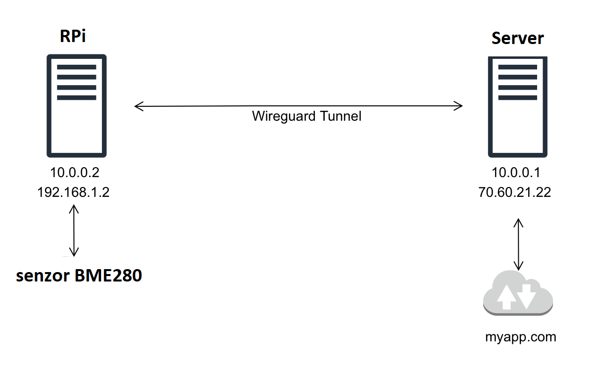

# Úkol č. 3
Jednoduchý HTTP server v Pythonu zobrazující aktuální teplotu a vlhkost (případně i tlak)

## Všeobecné podmínky
1. Senzor BME280
2. RPi s OS Raspbian 12
3. Kabeláž na propojení senzoru a RPi(alternativně BreadBoard)
4. Server s OS Debian a veřejnou IP a DNS záznamem

## Zapojeni sezoru a RPi


## Instalace prostředí Python na RPi
V adresáři s Python skripty je potřeba vytvořit environment a doinstalovat potřebné komponenty jako Gunicorn a Flask
```
python3 -m venv .env
source .env/bin/activate
pip install -r requirements.txt
```
### Vytvoření prostředí pro provoz HTTP serveru na RPi
Vytvoření souboru pro systemd `sudo nano /etc/systemd/system/flask.service`, vložení a doplnění níže uvedeného:
V souboru je potřeba doplnit:
- User
- WorkingDirectory
- ExecStar
- Environment

Obsah flask.service:
```
[Unit]
Description=Teplota Flask app
After=network-online.target
Wants=network-online.target

[Service]
User= <zde doplint>
Group=www-data
PIDFile=/var/tmp/flask.pid

WorkingDirectory= <zde doplnit cestu do adresare se skriptem>
Environment="PATH= <zde doplnit cestu do adresare se skriptem a Pythno environmentem>"
ExecStart= <zde doplnit cestu do adresare se skriptem>/.env/bin/gunicorn --workers 4 --bind 0.0.0.0:5006 -m 007 wsgi:app

Restart=on-failure
RestartSec=30
PrivateTmp=true

[Install]
WantedBy=multi-user.target
```

Následně je potřeba znovu načíst nově přidaný soubor do SystemD: `systemctl daemon-reload`
Po reloadu se spustí HTTP server příkazem: `systemctl start flask.service`

### Kontrola spuštění Flasku
Příkazem `ss -tulpn | grep 5006`by měl být vidět otevřený port 5006 s procesem gunicorn
Následně by měla být dostupná webová prezentace na IP adrese RPi a portu 5006


## Instalace podpory pro publikaci do internetu na RPi a na serveru s OS Linux
```
sudo apt update && sudo apt install wireguard wireguard-tools nginx
sudo wg genkey | tee wg-private.key | wg pubkey > wg-public.key
sudo nano /etc/wireguard/wg0.conf
```
### Obsah souboru `wg0.conf` pro RPi
```
[Interface]
Address = <privatni IP adresa tunelu>
PrivateKey = <obsah souboru wg-private.key>

[Peer]
PublicKey = <obsah souboru wg-public.key>
Endpoint = <IP veřejná adresa Serveru>
AllowedIPs = <IP adresy a rozsahy routované do tunelu>
PersistentKeepalive = 25
```
### Obsah souboru `wg0.conf` pro Server
```
[Interface]
Address = <privatni IP adresa tunelu>
PrivateKey = <obsah souboru wg-private.key>

[Peer]
PublicKey = <obsah souboru wg-public.key>
AllowedIPs = <IP adresy a rozsahy routované do tunelu>
PersistentKeepalive = 25
```
### Povolení komunikace prostřednictvím UFW na Serveru
```
ufw allow 51820/udp

```
###
Spuštění tunelu se provede na RPi i Serveru příkazem: `wg-quick up wg0`

### Kontrola fungování tunelu z RPi:
- Spuštěním `ping <privatni IP adresa serveru>` by mělo dojít k úspěšnému pingu

### Kontrola fungování tunelu ze Serveru:
- Spuštěním `ping <privatni IP adresa RPi>` by mělo dojít k úspěšnému pingu

## Konfigurace publikace prostřednictvím Nginx na RPi (volitelné)
Úprava konfigurace nginx v /etc/nginx/sites-available/senzor:
```
server {
    listen 80;
    location / {
        proxy_pass http://127.0.0.1:5006;
        proxy_set_header Host $host;
        proxy_set_header X-Real-IP $remote_addr;
    }
}
```
Povolení konfigurace a odebrání defaultní konfigurace:
```
sudo ln -s /etc/nginx/sites-available/senzor /etc/nginx/sites-enabled/
sudo rm /etc/nginx/sites-enabled/default
sudo nginx -t
sudo systemctl restart nginx
```

## Konfigurace publikace prostřednctvím Nginx na Serveru
###  Konfigurace Nginx
Úprava konfigurace nginx v /etc/nginx/sites-available/pub-senzor:
```
server {
    listen 80;
    location / {
        proxy_pass http://<IP adresa VPN tunelu RPi>:5006;  # pokud bude instalován Nginx na RPI, hodnota portu musí býrt nahrazena na: 80
        proxy_set_header Host $host;
        proxy_set_header X-Real-IP $remote_addr;
    }
}
```
Povolení konfigurace a odebrání defaultní konfigurace:
```
sudo ln -s /etc/nginx/sites-available/pub-senzor /etc/nginx/sites-enabled/
sudo rm /etc/nginx/sites-enabled/default
sudo nginx -t
sudo systemctl restart nginx
```
### Konfigruace TLS a Let's Encrypt
Instalace potřebných nástrojů:
```
sudo apt update && sudo apt install certbot python3-certbot-nginx -y

```

Získání certifikátu pro DNS jméno serveru:
```
sudo certbot --nginx -d <DNS jméno>
```
Po výše uvdených bodech by měla být stránka s údaji ze senzoru dostupná v interentu na https://mojeadres.cz

## Komunikační schema:
    
  
BME280 -> RPi-> Python + Flask -> Nginx (volitelně)-> Wirteguard VPN - tunel internetem -> Wireguard na Serveru-> Nginx (https) <- Prohlížeč uživatele

## Priklad konfigurace VPN:

